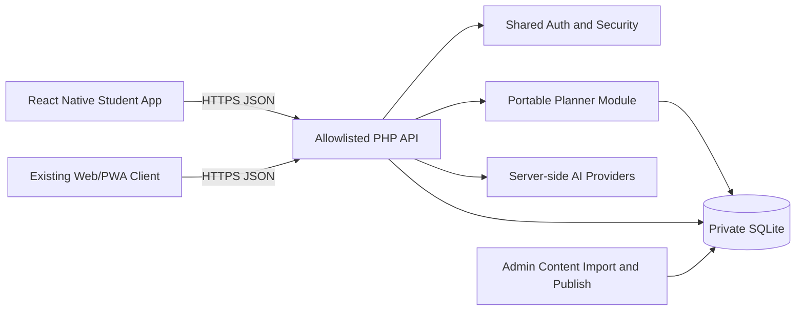

# NexA AI Student App — Technical Requirements Document

**Status:** Proposed implementation baseline  
**Version:** 1.0  
**Date:** 2026-08-09  
**Client:** React Native + TypeScript + Expo (recommended)  
**Server:** Existing NexA PHP API and SQLite planner backend

## 1. Technical decision summary

The mobile app is a thin, secure client over the existing NexA backend.

The app must not:

- Reimplement `PlannerEngine` or planner priority rules.
- Read or write SQLite directly.
- Contain Gemini, DeepSeek, Bedrock, Google OAuth secrets, admin credentials, or payment secrets.
- Treat client-calculated scores, task state, device IDs, or cached content as authoritative.
- Create a parallel `live_*`, Netlify, Deno, or second chat/backend architecture.

The server remains authoritative for identity, permissions, content trust, question answers, scoring, quotas, planner generation, task state, and progress.

## 2. System context



### Source-of-truth rules

| Concern | Authority |
|---|---|
| Identity and roles | Server auth/session/token layer |
| Exam, subjects, syllabus, PYQs | Published server content pack |
| Plan generation | `backend/planner/domain/PlannerEngine.php` |
| Manual plan validation | `backend/api/planner-manual.php` plus repository ownership checks |
| Task status and progress | Server database and planner repositories |
| Chat provider selection | Server AI pipeline |
| Presentation state | Mobile client |
| Offline cache | Mobile client, disposable and replaceable |

## 3. Recommended technology stack

### Mobile

- React Native with Expo and TypeScript.
- Expo Router or an equivalent typed navigation layer.
- TanStack Query for server state, cache invalidation, retries, and request lifecycle.
- Zustand or a small typed store for UI/session state only; do not duplicate server state there.
- `expo-secure-store` for refresh credentials and device secrets.
- `expo-sqlite` for bounded offline cache and mutation outbox.
- React Native accessibility APIs for labels, roles, focus, and announcements.
- Native streaming transport only where the existing chat contract supports it; otherwise use a server response endpoint with explicit loading and retry state.

### Existing server

- PHP 8.1+ with PDO SQLite and cURL.
- `backend/api/` as the only public PHP controller boundary.
- `backend/planner/` as the portable planner module.
- `backend/data/` as private writable runtime state.
- Versioned migrations through `scripts/migrate.php`.

### Build and release

- EAS or an equivalent CI build service for signed Android/iOS artifacts.
- Environment-specific API base URLs injected at build time.
- No secrets in JavaScript bundles, app config, source maps, or screenshots.

## 4. Repository layout

The mobile app should be added as a separate client directory without disturbing the approved web architecture:

```text
mobile/
  app/                         # typed routes/screens
  src/
    api/                       # HTTP client and endpoint adapters
    auth/                      # token session and account lifecycle
    components/                # reusable UI primitives
    features/
      planner/                 # Today, Week, Month, Progress, manual planning
      diagnostic/              # diagnostic flow
      practice/                # verified questions and mock entry
      chat/                    # conversation UI and retry states
      profile/                 # account and settings
    design-system/             # tokens, typography, spacing, icons
    offline/                   # local cache, outbox, sync coordinator
    telemetry/                 # consent-aware product events
    types/                     # API and domain types
    utils/                     # date, formatting, accessibility helpers
  assets/
  app.config.ts
  eas.json
  package.json
```

The web client remains in `frontend/`. Shared behavior belongs on the backend or in documented API contracts; do not import browser DOM code into the mobile app.

## 5. Mobile application architecture

Use a feature-first architecture with a strict separation between server state and presentation state:

```text
Screen
  -> feature hook/view-model
    -> TanStack Query or mutation hook
      -> typed API adapter
        -> secure HTTP client

Screen
  -> design-system components
  -> local UI state
```

### Rules

1. Screens may render data and dispatch intent; they must not build SQL, compute planner priority, or call providers.
2. API adapters normalize server responses into typed mobile models.
3. Query keys include authenticated user, exam, date range, and generation version where relevant.
4. Every mutation has loading, success, error, retry, and offline behavior.
5. Dates are serialized as `YYYY-MM-DD`; display formatting uses the device locale while planner calculations remain Asia/Kolkata unless the backend later makes timezone a user preference.
6. User/model/imported text is rendered as text or sanitized markdown; never interpolate it into executable HTML or native code.

## 6. Authentication and session design

The current web client uses cookie sessions. The mobile app requires a bearer-token extension of the shared auth system rather than a separate user database.

### Required server extension

Add a shared token service and explicit mobile controllers:

- `POST /api/auth-mobile-login.php`
- `POST /api/auth-mobile-refresh.php`
- `POST /api/auth-mobile-logout.php`
- `GET /api/auth-mobile-check.php` or extend `auth-check.php` with bearer support

These controllers must reuse the existing password, Google identity, security, rate-limit, user, and audit helpers. They must not contain separate password verification logic.

### Token rules

- Access token: short-lived, approximately 15 minutes, held in memory where practical.
- Refresh token: rotating, revocable, stored only in platform secure storage.
- Database stores a hash of each refresh token, never the raw token.
- Each token record includes user, device/session identifier, created time, expiry, last-used time, and revoked time.
- Refresh-token reuse invalidates the token family and requires a new sign-in.
- Logout revokes the current refresh token and clears local secure storage.
- Password reset and account security events revoke active mobile refresh tokens.

### Request authentication

The shared authentication helper should accept either:

- the existing secure web session cookie, or
- `Authorization: Bearer <access-token>` for mobile.

Authorization must remain server-side. A bearer token does not remove ownership checks.

### Mobile sign-in UX

- Never log or display tokens.
- Expired access token: refresh once, retry the original request once, then return to sign-in.
- Expired/revoked refresh token: clear private local state and show a clear sign-in screen.
- Google sign-in uses the native OAuth flow with the production mobile client IDs and server-side token verification.

## 7. API contract

### Existing endpoints reused by the app

| Endpoint | App use |
|---|---|
| `auth-login.php`, `auth-register.php`, `auth-profile.php`, `auth-logout.php` | Web-compatible account flows where bearer extension is supported |
| `app-config.php` | Public capability and environment configuration |
| `app-ask.php` / `ask.php` | Chat request and AI answer flow |
| `planner-profile.php` | Profile, availability, subjects, and syllabus topics |
| `planner-assessment.php` | Diagnostic start, answer, completion |
| `planner-month.php` | Current month read/regenerate |
| `planner-week.php` | Weekly tasks and subject focus |
| `planner-day.php` | Daily task list |
| `planner-manual.php` | Manual day/week creation |
| `planner-task.php` | Start, complete, skip, reschedule, reorder |
| `planner-question.php` | Verified task question |
| `planner-progress.php` | Topic progress and question outcomes |
| `report-problem.php` | Student issue report |

### Required app-specific endpoints

Add only when the existing endpoints cannot safely provide the contract:

- `app-sync.php`: authenticated bootstrap/sync response with server time, profile version, planner generation versions, pending changes, and invalidation hints.
- `app-content-manifest.php`: published content-pack versions and downloadable verified-content metadata; no private source files.
- `auth-mobile-*.php`: native token lifecycle described above.

Every new controller must be explicitly added to `.htaccess` and `scripts/local-router.php`, use the shared security helper, validate its request body, and return safe JSON errors.

### Request envelope

The app should send:

```json
{
  "client_request_id": "uuid",
  "client_platform": "android",
  "client_version": "1.0.0",
  "payload": {}
}
```

Existing web payloads remain backward compatible. The server may accept the current payload shape and optional app metadata during migration.

### Standard response metadata

Responses should expose, where relevant:

```json
{
  "success": true,
  "request_id": "opaque-request-id",
  "server_time": "2026-08-09T16:30:00Z",
  "data": {},
  "generation_version": "planner-v1:..."
}
```

The current plain response shapes may be retained for compatibility while the mobile adapter maps them into this internal model.

### Manual plan contract

The current endpoint remains the authoritative contract:

```json
{
  "scope": "week",
  "week_start": "2026-08-03",
  "entries": [
    {
      "scheduled_date": "2026-08-03",
      "subject_code": "EN",
      "topic_id": 123,
      "task_type": "practice",
      "estimated_minutes": 40,
      "title_en": "Parts of speech review"
    }
  ]
}
```

Server validation must enforce authentication, date validity, same-day/same-week scope, supported subjects, topic-to-subject ownership, task type, duration limits, target month availability, and duplicate request handling.

### Error contract

The API must return:

```json
{
  "error": "Choose a valid syllabus topic.",
  "code": "invalid_topic",
  "request_id": "opaque-request-id"
}
```

The app maps codes to friendly copy and logs only the opaque request ID. Provider, SQL, filesystem, and stack details never reach the app.

## 8. Offline cache and synchronization

### Offline promise

Phase 1 supports resilient online use and a bounded read cache. Phase 3 adds deeper offline study packs and queued mutations. The app must be honest about which actions need connectivity.

### Local tables

The mobile SQLite cache may contain:

- `cache_meta(key, value, updated_at)`
- `cached_profile(user_id, payload_json, updated_at)`
- `cached_planner_views(user_id, view_key, generation_version, payload_json, updated_at)`
- `cached_content_manifest(exam_code, version, payload_json, updated_at)`
- `cached_questions(exam_code, question_id, payload_json, updated_at)`
- `mutation_outbox(id, client_request_id, operation, payload_json, status, retry_count, last_error, created_at, updated_at)`

No raw access token, refresh token, password, private key, or full private chat history should be stored in SQLite.

### Read behavior

- Online: request server data and update cache.
- Offline with cache: show cached data with an explicit “Last updated” label.
- Offline without cache: show an actionable empty state and retry control.
- On foreground/resume: revalidate Today and pending mutations.
- Use ETags or generation versions to avoid downloading unchanged planner views.

### Mutation behavior

1. Create a UUID `client_request_id`.
2. If online, send the mutation and wait for server acknowledgement.
3. If offline and the operation is safe to queue, store it in the outbox.
4. Show “Queued” rather than “Saved”.
5. When online, send oldest first with idempotency metadata.
6. On success, update cache from the server response.
7. On validation conflict, keep the server state, mark the operation failed, and show the student a repair action.

Queueable operations in Phase 3:

- Manual plan creation.
- Task completion/skip/start.
- Task reorder/reschedule where the target remains valid.
- Practice answer submission.

Chat generation is not queued as a fake success. The student may retry it when online.

### Conflict policy

- Server wins for task status, question correctness, progress, content, and planner generation.
- Manual tasks are additive and identified by server task ID after acknowledgement.
- A duplicate `client_request_id` returns the original result rather than creating a second task.
- A regenerated month preserves manual task records according to the server repository contract.

## 9. Planner implementation requirements

The mobile client consumes, but never modifies, these planner concepts:

- profile and availability,
- weekly subject preferences,
- diagnostic state,
- month/week/day tasks,
- manual task origin,
- task status,
- question outcome,
- topic progress,
- generation version.

The mobile client must not calculate the three-subject rule, official weights, mastery, revision intervals, or adaptive priority. It may calculate display totals only, and those totals must be labeled as presentation values.

### Query keys

Recommended keys:

```text
planner.profile(userId)
planner.day(userId, date, generationVersion)
planner.week(userId, weekStart, generationVersion)
planner.month(userId, year, month, generationVersion)
planner.progress(userId, examCode)
planner.question(userId, taskId)
```

After a task mutation, invalidate day, week, month, progress, and question queries as appropriate. Do not invalidate the entire app cache for a single task action.

## 10. UI and design-system requirements

### Visual foundations

- Use the NexA blue logo and the approved blue/cyan brand palette.
- Use a calm light surface, strong navy text, accessible blue primary action, and a restrained secondary lavender accent.
- Use Lucide or the existing NexA icon system; no emojis as product UI icons.
- Use a Bengali-capable font fallback only where Bengali assistant text is displayed; academic planner content remains English.

### Reusable components

- `AppShell`
- `BottomTabBar`
- `TopBar`
- `PrimaryButton`, `SecondaryButton`, `IconButton`
- `TaskCard`
- `TaskActionBar`
- `PlannerViewTabs`
- `SubjectChip`
- `TopicPicker`
- `ManualPlanSheet`
- `QuestionCard`
- `ProgressBar`
- `OfflineBanner`
- `ErrorState`
- `SkeletonList`

### Interaction requirements

- The manual planner should be a bottom sheet on phones and a centered dialog on larger screens.
- Week rows must support add, remove, and validation before submission.
- Destructive or terminal actions require clear confirmation where accidental activation is likely.
- Keyboard, screen reader, dynamic type, reduced motion, and dark mode must be supported.
- Loading must not cause the primary layout to jump or overlap the bottom navigation.

## 11. Security requirements

- HTTPS only in non-local builds; reject invalid certificate configurations in release builds.
- Secure storage for refresh credentials.
- Certificate pinning is optional and must not block emergency certificate rotation without a tested fallback plan.
- Never place provider keys, database paths, admin hashes, or secrets in the app.
- Enforce server-side authorization for every planner/task/question/progress request.
- Add rate limits for login, token refresh, chat, diagnostic, practice answers, and manual-plan mutations.
- Redact tokens, question text, private chat, and personal details from logs and analytics.
- Use request IDs and client version metadata for support diagnosis.
- On logout, clear secure credentials, private cache, outbox, and user-scoped query data.
- Do not trust deep links until their route and resource ownership are checked server-side.

## 12. Performance and reliability budgets

- Cold launch to usable shell: under 2.5 seconds on a mid-range Android device after local bundle load.
- Cached Today render: under 500 ms after app shell is ready.
- Online Today render: meaningful content under 1.5 seconds on a normal 4G connection.
- Manual plan save: visible acknowledgement under 2 seconds online, excluding network failure.
- App bundle should be split or lazily loaded so chat, practice, and admin-inapplicable code do not delay the shell.
- Crash-free sessions target 99.5% after beta.
- All requests have bounded timeout, cancellation, retry policy, and error mapping.

## 13. Observability

Track consented, non-content events:

- app opened,
- sign-in success/failure category,
- planner onboarding step completed,
- diagnostic started/completed,
- planner view opened,
- manual plan saved/failed,
- task started/completed/skipped,
- offline queue added/synced/conflicted,
- chat request success/failure category,
- app update and crash-free session.

Never send full prompts, answers, question text, private notes, or message bodies to analytics.

Server logs should correlate app `client_request_id`, opaque request ID, user ID, endpoint, response code, and release version without recording secrets or content payloads.

## 14. Testing strategy

### Mobile unit tests

- Date/week calculations and timezone formatting.
- API response normalization.
- Query invalidation.
- Form validation for manual day/week planning.
- Outbox retry and idempotency behavior.
- Auth token expiry and refresh state machine.
- Accessibility labels and button states.

### Mobile component tests

- Today, Week, Month, Progress states.
- Empty/loading/error/offline states.
- Manual planning sheet with valid and invalid rows.
- Task action transitions.
- Diagnostic option selection.
- Question submission feedback.

### Mobile end-to-end tests

1. Fresh install to sign-in.
2. Onboarding and diagnostic.
3. Today task completion.
4. Manual day session creation.
5. Manual week batch creation.
6. Month refresh preserves manual sessions.
7. Offline cached read and queued task mutation.
8. Token expiry and reauthentication.
9. Logout clears private state.
10. Dark mode, dynamic text, screen reader labels, and small-screen layout.

### Backend contract tests

- Bearer authentication and token rotation.
- Cross-user access denial.
- Manual day/week schema validation.
- Duplicate `client_request_id` behavior.
- Manual task persistence through regeneration.
- Existing web session compatibility.
- ETag/generation-version consistency.
- Safe error shapes and request IDs.

### Release gates

```powershell
npm run check
python -m py_compile deploy_all.py
php scripts/migrate.php --dry-run
powershell -NoProfile -ExecutionPolicy Bypass -File scripts/verify-release.ps1
```

Additional mobile gates:

- TypeScript check and lint.
- Unit/component test suite.
- Android debug and release smoke build.
- iOS simulator and TestFlight smoke build.
- Accessibility scan.
- Offline/reconnect test on airplane mode.
- No secrets or private runtime files in the app artifact.

## 15. Deployment and rollout

### Environments

- Local: `127.0.0.1`/`localhost` API, demo data, no production tokens.
- Staging: HTTPS API, staging database/content pack, test OAuth clients, test push project.
- Production: HTTPS canonical API, production OAuth clients, private data directory, release migration and backup.

### Backend rollout order

1. Deploy shared bearer-token support and database migration.
2. Deploy idempotency/request metadata support.
3. Deploy any sync/content-manifest controllers and explicit route allowlist entries.
4. Verify web login, web planner, manual planning, and existing APIs.
5. Release the mobile app with feature flags disabled for offline writes.
6. Enable internal testing, then staged beta.

### Mobile rollout order

1. Internal Android build.
2. Small closed beta with crash/error monitoring.
3. Add iOS TestFlight after planner parity is stable.
4. Enable offline queue only after duplicate and conflict tests pass.
5. Public release with staged rollout and rollback-ready server flags.

## 16. Risks and mitigations

| Risk | Mitigation |
|---|---|
| Mobile auth diverges from web auth | One shared auth service and bearer adapter; no duplicate password logic |
| Offline writes create duplicates | UUID client request IDs, server idempotency, rotating outbox state |
| App ships stale/incorrect questions | Published content manifest, trust labels, server-side authoritative question flow |
| Planner logic diverges between clients | All generation and validation remain in backend planner module |
| Large syllabus makes initial payload slow | Paginated/content-manifest delivery and bounded local cache |
| Network/provider failure looks like a broken app | Explicit offline, retry, and provider-unavailable states |
| Native OAuth configuration blocks release | Separate staging/production client IDs and early TestFlight/internal testing |
| New app increases maintenance surface | Feature-first modules, typed API contracts, shared design tokens, automated release gates |

## 17. Definition of technical readiness

The app architecture is ready for implementation when:

1. Mobile bearer auth and token revocation are specified and tested.
2. Existing planner endpoints are contract-tested for both web session and bearer auth.
3. Manual day/week requests support idempotent retries.
4. The mobile app can render cached and online Today/Week/Month views.
5. The app cannot make a planner decision or authoritative content decision locally.
6. Release builds contain no secrets and pass accessibility, offline, security, and smoke gates.
