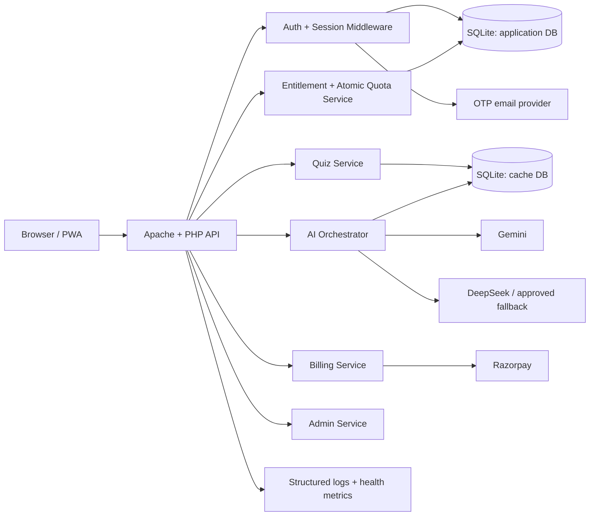

# NexA AI — Technical Requirements Document

**Document status:** Implementation baseline; production approval pending
**Version:** 1.1
**Date:** 2026-08-07  
**Related document:** [PRD.md](PRD.md)

## 1. Technical executive summary

The implementation uses one PHP/SQLite runtime for production. Historical Netlify and diagnostic code has been isolated under `.quarantine/` and is excluded from routing and release packaging.

The system will be organized around a small set of explicit services inside the PHP application: authentication, authorization, entitlements, rate limiting, AI orchestration, quiz management, billing, and administration. Shared middleware and service contracts are mandatory. Browser code is a client, never an authority for identity, plan, price, quota, or payment state.

## 2. Source-of-truth rules

1. **PRD:** desired user and business behavior.
2. **TRD:** target architecture, security controls, interfaces, and operational requirements.
3. **Current source:** implementation evidence only; it is not proof that a requirement is satisfied.
4. **Master document:** product context and historical decisions. Its “fixed locally/upload needed” notes must be verified against source and deployment state.

Any conflict must be resolved in favor of the PRD/TRD after an explicit technical decision is recorded.

## 3. Target architecture



### 3.1 Runtime decision

The initial production target is the current frontend/backend layout:

- Apache with PHP 8.x and required extensions.
- SQLite and private runtime files stored in `backend/data/`, denied by the web server and excluded from releases.
- Static frontend assets served by Apache.
- PHP API endpoints under `/api/`.
- HTTPS enforced at the edge/server.

No alternate runtime is part of the production path. Historical experiments remain outside the public route and must not be reintroduced.

## 4. Repository target structure

The repository now separates the browser client, PHP API, private runtime state, integrations, scripts, and recoverable historical code.

```text
frontend/
  index.html, login.html, admin.html, and legal pages
  nexa-app.js, nexa-main.css, admin assets, PWA assets
backend/
  api/             canonical PHP controllers and shared services
  data/            private SQLite databases, logs, and credentials
  integrations/    Telegram and Bedrock integration assets
scripts/            local server, checks, and release verification
.quarantine/        recoverable historical code; never deployed
PRD.md, TRD.md, AGENTS.md, README.md
```

The current structure is the implementation baseline; the following launch constraints remain mandatory:

- Runtime databases, logs, uploads, backups, and `.env` are not web-accessible.
- Test/debug/diagnostic scripts are outside the public directory or disabled in production.
- One canonical frontend engine remains; `app.js`, `app.bak.js`, `nexa-engine.js`, and legacy duplicates are either consolidated or explicitly removed from production delivery.
- Generated Lighthouse output, temporary deployment files, and local diagnostics are not release artifacts.

## 5. Configuration and secrets

- Production secrets are injected through the host environment or a secret file outside the web root.
- `.env` must be removed from Git history and excluded from every deployment package.
- Deployment tooling must use environment-provided credentials and must never upload `.env`.
- Rotate every credential previously present in local files: AI providers, Razorpay, Firebase, Telegram, Google OAuth, SMTP/email, FTP/cPanel, and bot credentials.
- `config.example.php` or `.env.example` may contain names and safe placeholders only.
- Application startup must fail closed with a clear operational log if a required secret is absent or malformed.
- Never include secrets in frontend JavaScript, PHP error responses, logs, exports, screenshots, or analytics.

## 6. Security architecture

### 6.1 Authentication and sessions

- Use one canonical auth abstraction, e.g. `AuthContext`, for both user and admin requests.
- Store only a hash of persistent auth tokens; compare with constant-time verification.
- Rotate session ID on login, registration verification, password reset, privilege change, and Google account linking.
- Cookies: `Secure`, `HttpOnly`, and appropriate `SameSite` (`Lax` for the normal app unless a documented cross-site flow requires otherwise).
- Use a bounded persistent-login lifetime with explicit revocation; do not default to a one-year bearer token.
- Password reset invalidates all existing persistent tokens for the account.
- Login and OTP attempts are keyed safely and rate-limited without account enumeration.

### 6.2 Authorization

Create centralized middleware:

```php
requireUser(): AuthContext
requireAdmin(): AdminContext
requireRole(string ...$roles): AdminContext
```

Every admin endpoint must call the same middleware. The legacy split between `$_SESSION['admin']` and `$_SESSION['admin_logged_in']` is prohibited. The canonical session field is `admin_logged_in`, with a role value stored separately if roles are introduced.

Missing JWT/session configuration must cause rejection, never an unverified-token fallback. No endpoint may treat a decoded token as authenticated unless its signature, issuer, audience, expiry, and required claims have been verified.

### 6.3 CORS and CSRF

- Allow only the production web origin and explicitly approved development origins.
- Never reflect arbitrary `Origin` values when `Access-Control-Allow-Credentials: true` is present.
- Use CSRF tokens for cookie-authenticated state-changing requests, including auth state changes, profile updates, admin actions, and billing operations.
- Validate `Origin`/`Referer` where appropriate as a defense-in-depth check.
- Keep app-mode/device-token endpoints separate from cookie-authenticated endpoints.

### 6.4 Input and file handling

- Validate every field by type, length, enum, and business rule on the server.
- Use prepared SQL statements for all dynamic values.
- Enforce request body, image, PDF, page-count, and decoded-base64 limits before expensive processing.
- Validate MIME type using file content, not only the client filename or header.
- Store uploads outside the public directory with generated names and restrictive permissions.
- Never render untrusted values into `innerHTML` or inline event-handler attributes. Use text nodes, DOM APIs, or a reviewed sanitizer.
- Version and pin external frontend dependencies; prefer self-hosting critical libraries or using SRI where CDN delivery remains necessary.

### 6.5 HTTP headers

Configure headers at the actual production server, not only in `.htaccess` assumptions:

- HSTS after HTTPS readiness.
- `Content-Security-Policy` with an explicit script/style/connect/font/image policy.
- `X-Content-Type-Options: nosniff`.
- `Referrer-Policy: strict-origin-when-cross-origin`.
- `Permissions-Policy` limited to features the application uses.
- `frame-ancestors 'none'` unless an approved embedding use case exists.
- No-cache or private cache rules for authenticated/API responses.

## 7. Data architecture

### 7.1 Databases

Keep application data and AI cache logically separate. Both require migrations, backups, indexes, and integrity checks.

Application data includes:

- `users`, `pending_users`
- `rate_limits`, `ip_limits`, `login_attempts`
- `api_usage_log`, `daily_stats`, `recent_queries`, `analytics_subject`
- `bug_reports`, `global_config`, `subscription_plans`, `user_subscriptions`, `payments`
- `fcm_tokens`, `telegram_users`, `password_resets`, `otp_requests`

Cache data includes:

- `quizzes`, `user_quiz_history`, `cache_responses`

### 7.2 Required schema corrections

- Add or remove references to the nonexistent `users.profile` column; leaderboard queries must use defined profile fields only.
- Add explicit timestamps with one timezone convention, preferably UTC in storage and localized only at presentation.
- Add unique constraints for user email, referral code, provider identifiers, payment order IDs, and idempotency keys.
- Add foreign keys where supported and validate them in migrations.
- Add indexes for email lookup, active subscription lookup, usage-window lookup, payment order lookup, and recent-query retrieval.
- Store OTP/reset/auth tokens as hashes, with expiry, purpose, attempt count, used timestamp, and creation timestamp.
- Store payment status transitions rather than overwriting the only state.

### 7.3 Migration rules

- Migrations are numbered, forward-only, idempotence-aware, and run through a protected CLI/deployment step.
- A migration endpoint must not be publicly reachable and must not contain self-delete behavior.
- Back up the database before schema changes.
- Every migration has a rollback/restore note, even if the migration itself is not automatically reversible.

## 8. Entitlement and quota service

All AI and quiz entry points must call one service, for example:

```text
EntitlementService::authorize($user, $capability, $idempotencyKey)
  -> verifies account/plan/expiry/feature flag
  -> atomically reserves or consumes quota
  -> returns remaining quota and an authorization decision
```

Technical rules:

- Resolve the current plan from server-side subscription records, not client input.
- Apply `free`, `pro`, or `premium` limits; the current global-only limiter behavior is not acceptable.
- Use an atomic database operation or transaction to prevent concurrent requests from exceeding quota.
- Distinguish a request reservation from a completed request so provider failure can be refunded or recorded according to policy.
- Use a trusted proxy configuration before accepting `CF-Connecting-IP` or `X-Forwarded-For`; otherwise use the direct peer address.
- Normalize identity keys consistently. The key used for enforcement must be the same key used by auth-check and usage display.
- Return stable error codes such as `AUTH_REQUIRED`, `QUOTA_EXHAUSTED`, `FEATURE_DISABLED`, and `MAINTENANCE_MODE`.

## 9. AI orchestration

### 9.1 Request pipeline

1. Authenticate the request or resolve approved guest identity.
2. Validate text, files, language, and requested capability.
3. Authorize and reserve quota.
4. Normalize the prompt for cache lookup without storing raw sensitive content in logs.
5. Check the versioned cache for an eligible response.
6. Call Gemini as primary with configured timeout and output limits.
7. Use the approved fallback only for defined provider failures and only when configuration is valid.
8. Stream sanitized output to the browser using the documented SSE contract.
9. Commit usage, conversation metadata, and safe analytics exactly once.
10. Release/refund reservation according to the failure policy if no answer was produced.

### 9.2 Provider controls

- Provider keys and model names are configuration, never hardcoded fallbacks.
- Set connect/read/overall timeouts, maximum output, retry count, and circuit-breaker thresholds.
- Do not retry non-idempotent operations blindly.
- Record provider, latency, status class, fallback usage, and error code; do not record full prompts or secrets.
- The configured model and prompt template have a version that participates in cache keys.
- AI-generated quiz output must be schema-validated before persistence or display.

### 9.3 Cache rules

- Cache key includes normalized request, prompt version, model policy, language, and feature version.
- Default TTL is 14 days unless an administrator changes it within a safe range.
- Cache only responses approved as non-personal and non-error.
- Cache hits still pass entitlement checks.
- Avoid caching prompts containing names, emails, account details, or uploaded private documents.
- Provide a safe admin invalidation mechanism with audit logging.

## 10. API contract

### 10.1 General response envelope

JSON success:

```json
{
  "ok": true,
  "data": {},
  "request_id": "req_..."
}
```

JSON error:

```json
{
  "ok": false,
  "error": {
    "code": "QUOTA_EXHAUSTED",
    "message": "Your current plan has no remaining requests."
  },
  "request_id": "req_..."
}
```

Do not expose stack traces, SQL, provider keys, filesystem paths, or internal exception messages.

### 10.2 Endpoint requirements

| Area | Public contract | Auth | Key technical controls |
|---|---|---|---|
| Auth | `/api/auth-register.php`, `/api/auth-verify.php`, `/api/auth-login.php`, `/api/auth-check.php`, reset/Google endpoints | Mixed | Validation, OTP limits, session rotation, CSRF where cookie state changes |
| Tutor | `/api/ask.php` | User or approved guest | Entitlement service, upload limits, SSE, timeout, safe logging |
| Quiz | `/api/quiz-api.php` | User | Schema validation, quota, authoritative scoring |
| Billing | subscribe/verify endpoints | User | Server-side plan/order, signature, ownership, idempotency |
| Admin | `/api/admin-*.php` | Admin | One middleware, role checks, audit log, no wildcard CORS |
| Public | leaderboard/report/health as approved | Mixed | Data minimization, rate limits, no private fields |

The exact endpoint names may remain compatible with the current frontend during migration, but implementation must converge on one documented contract. Every endpoint must specify method, content type, maximum body size, auth mode, CSRF requirement, rate limit, response codes, and audit behavior.

### 10.3 Streaming contract

Use `text/event-stream` with explicit event types:

```text
event: meta
data: {"request_id":"req_..."}

event: chunk
data: {"text":"..."}

event: done
data: {"usage_remaining":19}

event: error
data: {"code":"PROVIDER_UNAVAILABLE"}
```

The server must close the stream after `done` or `error`. The client must handle disconnects, duplicate terminal events, and cancellation without duplicating messages or quota charges.

## 11. Billing implementation

- `subscription_plans` is the server authority for active plans, price, currency, period, allowance, and enabled capabilities.
- Payment order creation stores user ID, plan ID, amount, currency, provider order ID, status, and idempotency key.
- Verification checks authenticated ownership, provider signature, provider order/payment relationship, server amount, server plan, expected status, and replay state.
- Webhook handling, if enabled by the payment account, verifies provider authenticity and is idempotent.
- Entitlements are granted from a committed payment state transition, not from browser success callbacks.
- Refund/chargeback/cancellation transitions revoke or adjust access according to the published policy.
- Payment and entitlement operations are logged with opaque IDs; never log card/payment secrets.

## 12. Frontend technical requirements

- Keep one production application entry point and one shared design token system.
- Consolidate duplicated engines and remove backup files from the shipped asset graph.
- Escape or text-render all API-derived values; no API value may become an inline `onclick` string.
- Sanitize AI Markdown with a configured allowlist, and protect the legacy quiz path with the same policy.
- Pin CDN versions and use SRI, or self-host critical dependencies.
- Add a real build/lint/test workflow even if the final assets remain static.
- Lazy-load KaTeX, highlighting, PDF/image tooling, and admin-only code where practical.
- Use abortable `fetch` requests and preserve unsent user text during transient failures.
- Keep auth state, quota state, and plan state in one source of truth in the client.

## 13. Performance budgets

- HTML response p75 ≤ 500 ms from the production origin for the shell.
- Core CSS ≤ 100 KB compressed target.
- Core JS ≤ 250 KB compressed target; admin and heavy tools are separate chunks.
- Logo and icon assets are deduplicated and served at correct dimensions; do not ship four identical full-size PNGs.
- Avoid floating CDN major versions; every third-party asset is reviewed for size and security.
- Set cache headers for immutable hashed assets and private/no-store behavior for account/API content.

## 14. Observability and operations

Every request receives a correlation/request ID. Structured logs should include:

- timestamp, request ID, route, method, status, duration
- authenticated user ID or one-way pseudonymous guest ID
- quota decision and plan ID where relevant
- provider name/status/latency/fallback flag for AI requests
- payment/order opaque ID for billing events
- error code and deployment version

Never log passwords, OTP values, auth tokens, raw uploaded documents, full prompts, payment secrets, or provider keys.

Minimum operational views:

- health check for PHP/database/config readiness, without revealing secrets
- error rate and latency by route
- AI provider failure/fallback rate
- quota rejection rate
- payment verification success/failure/pending rate
- backup age and last successful restore test

## 15. Backup, recovery, and deployment

### Deployment

1. Run local checks and build the frontend.
2. Run PHP lint and migration validation.
3. Create a versioned release package that excludes secrets, local databases, logs, diagnostics, and test fixtures.
4. Back up production databases.
5. Upload through one approved deployment process using environment-provided credentials.
6. Run migrations through the protected deployment command.
7. Run health/auth/AI/quota/payment smoke tests.
8. Record release version and migration state.

### Rollback

- Keep the previous immutable release package available.
- Roll back application assets first when safe.
- Do not blindly reverse destructive migrations; restore a verified database backup or use a forward corrective migration.
- Document who can approve rollback and the expected maximum recovery time.

### Recovery targets

- Target RPO: 24 hours for general study data, with a shorter target for payment records if host capabilities permit.
- Target RTO: 4 hours for the core application.
- Restore tests must be performed at least monthly after launch.

## 16. Quality gates and test plan

### Static and unit checks

- PHP syntax/lint for all production PHP.
- JavaScript lint and syntax/type checks for all shipped JS.
- Dependency audit and lockfile verification.
- Unit tests for validation, language policy, quota calculations, cache keys, payment verification, and session helpers.

### Integration tests

- Registration, OTP expiry/use/attempt limits, login lockout, logout, and password reset.
- Admin authorization across every admin route.
- CORS/CSRF rejection for unauthorized origins and missing tokens.
- Concurrent quota consumption.
- AI provider timeout/fallback/cache behavior.
- Payment ownership, amount/plan tampering, replay, pending, and refund paths.
- Upload MIME/size/page validation.

### Browser tests

- Mobile 390px and desktop login/app flows.
- New registration and returning session.
- Text question streaming, provider error, retry, quota exhausted.
- Image/PDF submission.
- Quiz start/answer/score/history.
- Plan purchase success/failure/pending.
- Admin login and one representative operation per admin module.
- PWA install/update/offline shell.

### Security tests

- Secret scan on repository and release package.
- Authenticated CORS and CSRF checks.
- XSS payloads in names, plan values, announcements, quiz content, and AI output.
- SQL injection and path traversal probes.
- Rate-limit bypass attempts through headers, concurrent requests, and identity-key variants.
- JWT/session fail-closed tests.
- Public route inventory confirming debug/migration/test endpoints are absent.

### Accessibility tests

- Keyboard-only navigation.
- Screen-reader labels for form controls, modal state, streaming state, and errors.
- Color contrast, focus visibility, reduced motion, and 200% text zoom.

## 17. Implementation sequence

### Milestone T0 — Containment

- Rotate exposed credentials.
- Remove secret files from source and deployment scope.
- Establish Git baseline and protected branches.
- Choose PHP/Apache/SQLite as the single production runtime.

### Milestone T1 — Core platform

- Central config, request IDs, error envelope, auth middleware, admin middleware, CSRF, strict CORS.
- Migrations, backup scripts, token hashing, session rotation, and production headers.

### Milestone T2 — Correctness

- Central entitlement/quota service with plan-specific atomic limits.
- Payment order/verification hardening and idempotency.
- AI orchestrator, cache versioning, SSE contract, upload validation.
- Remove broken/public diagnostics and reconcile schema inconsistencies.

### Milestone T3 — Frontend consolidation and premium quality

- One frontend engine, safe rendering, pinned dependencies, asset optimization, loading/error/empty states, responsive/accessibility fixes.
- Add automated browser and accessibility smoke tests.

### Milestone T4 — Release operations

- CI, staging deployment, smoke checks, monitoring, backups, restore rehearsal, and rollback rehearsal.
- Production launch only after every PRD launch gate passes.

## 18. Technical risks and mitigations

| Risk | Severity | Mitigation |
|---|---|---|
| Secret exposure and credential reuse | Critical | Rotate immediately; secret scan; exclude from package and history. |
| Conflicting PHP/Netlify runtimes | Critical | Select one runtime; remove/segregate the other; test deployed routes. |
| Inconsistent admin session keys | High | One middleware and canonical session contract; route-wide integration test. |
| Plan limits ignored or raceable | High | Central entitlement service; atomic transaction; concurrency tests. |
| Payment tampering/replay | Critical | Server-side order authority, ownership/amount/plan validation, idempotency, webhooks. |
| Credentialed wildcard/reflected CORS | High | Explicit origin allowlist and CSRF. |
| Unsanitized admin/quiz rendering | High | DOM text APIs, sanitizer policy, XSS tests. |
| Public diagnostics/migration routes | High | Remove from public tree; production route inventory. |
| SQLite/host operational limits | Medium | WAL/transaction tuning, backups, traffic limits, and migration path to managed DB if growth requires it. |
| AI latency/cost variability | Medium | Timeouts, caching, output limits, provider circuit breaker, usage metrics. |

## 19. Definition of done

A technical milestone is done only when:

- the implementation satisfies the mapped PRD requirements;
- tests cover both success and failure paths;
- security-sensitive behavior has a negative test;
- logs and metrics are sufficient to diagnose production failure without sensitive data;
- documentation and deployment instructions are updated;
- the change has been exercised against the actual target runtime or an equivalent staging environment.

